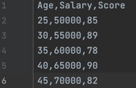
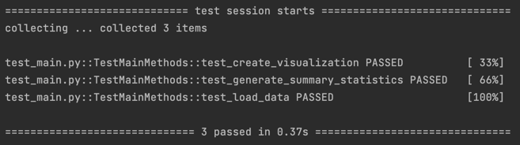

# Pandas Descriptive Statistics Script

## Goal

> Duke University IDS 706 Weekly Mini Project 2

This create a descriptive statistics script using Pandas and display basic information about the data set as well as filter the salary that larger than 60000.

## Preparation

1. make sure a data.csv file is in the same directory as main.py
2. Python 3.x.x
3. Pandas

## Run and Result

### Run

`python main.py`

### Result

### Test
`make test` or `python test_main.py`

## Reference

1.  https://github.com/nogibjj/python-template